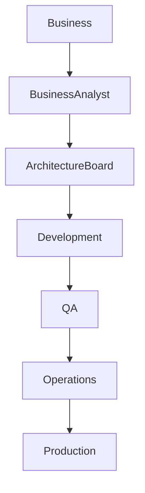

# Chapter 04
# Stakeholders

---

# 1. Purpose

This chapter identifies the stakeholders of the Oracle Dynamic Application Framework (ODAF), their architectural concerns, responsibilities, viewpoints, and influence on architectural decisions.

Understanding stakeholder concerns is essential to producing an architecture that satisfies both business and technical objectives.

This chapter follows the stakeholder and concern concepts defined by ISO/IEC/IEEE 42010.

---

# 2. Scope

This chapter defines:

- stakeholder identification;
- stakeholder classification;
- stakeholder concerns;
- architectural viewpoints;
- architecture views;
- decision authority;
- communication model;
- responsibility matrix.

This chapter does not define implementation details.

---

# 3. Stakeholder Definition

A stakeholder is any individual, organization, or system that has an interest in the architecture of ODAF.

A stakeholder may:

- define requirements;
- consume architecture;
- implement components;
- review decisions;
- approve changes;
- operate the platform;
- extend the platform.

Every architectural decision SHALL consider the concerns of one or more stakeholders.

---

# 4. Stakeholder Categories

ODAF recognizes the following stakeholder categories.

| Category | Description |
|----------|-------------|
| Business | Defines business objectives |
| Architecture | Defines platform architecture |
| Development | Implements platform capabilities |
| Operations | Operates production environments |
| Governance | Controls standards and compliance |
| Integration | Connects external systems |
| Consumers | Uses the platform |

---

# 5. Stakeholder Register

The following stakeholders are recognized by this specification.

| Stakeholder | Category |
|-------------|----------|
| Executive Sponsor | Business |
| Product Owner | Business |
| Enterprise Architect | Architecture |
| Solution Architect | Architecture |
| Chief Software Architect | Architecture |
| Oracle Database Architect | Architecture |
| Runtime Architect | Architecture |
| Security Architect | Architecture |
| Backend Developer | Development |
| Frontend Developer | Development |
| ODAF Studio Developer | Development |
| QA Engineer | Development |
| DevOps Engineer | Operations |
| Platform Administrator | Operations |
| Database Administrator | Operations |
| Business Analyst | Business |
| Technical Writer | Governance |
| Extension Developer | Development |
| Auditor | Governance |
| End User | Consumers |

---

# 6. Stakeholder Concerns

Each stakeholder has one or more architectural concerns.

The architecture SHALL address these concerns.

## Executive Sponsor

Primary concerns:

- business value;
- project cost;
- delivery time;
- governance;
- investment protection.

---

## Product Owner

Primary concerns:

- business capability;
- feature delivery;
- usability;
- roadmap;
- customer satisfaction.

---

## Enterprise Architect

Primary concerns:

- enterprise alignment;
- architectural consistency;
- governance;
- standards;
- interoperability.

---

## Chief Software Architect

Primary concerns:

- platform architecture;
- maintainability;
- extensibility;
- technical debt;
- long-term evolution.

---

## Oracle Database Architect

Primary concerns:

- metadata repository;
- scalability;
- transaction consistency;
- backup;
- recovery;
- performance.

---

## Runtime Architect

Primary concerns:

- execution engine;
- metadata loading;
- concurrency;
- performance;
- scalability.

---

## Security Architect

Primary concerns:

- authentication;
- authorization;
- audit;
- compliance;
- encryption.

---

## Backend Developer

Primary concerns:

- APIs;
- runtime services;
- datasets;
- compiler;
- plugins.

---

## Frontend Developer

Primary concerns:

- rendering;
- layouts;
- usability;
- responsiveness;
- accessibility.

---

## DevOps Engineer

Primary concerns:

- deployment;
- monitoring;
- observability;
- automation;
- infrastructure.

---

## QA Engineer

Primary concerns:

- correctness;
- repeatability;
- traceability;
- compliance;
- regression testing.

---

## Business Analyst

Primary concerns:

- metadata;
- workflows;
- validation;
- business rules.

---

## Platform Administrator

Primary concerns:

- configuration;
- user management;
- monitoring;
- backup;
- platform health.

---

## End User

Primary concerns:

- usability;
- response time;
- reliability;
- productivity.

---

# 7. Stakeholder Viewpoints

ISO 42010 associates stakeholders with viewpoints.

The following viewpoints are defined.

| Viewpoint | Primary Stakeholders |
|------------|---------------------|
| Business Viewpoint | Executive Sponsor, Product Owner |
| Enterprise Viewpoint | Enterprise Architect |
| Solution Viewpoint | Solution Architect |
| Metadata Viewpoint | Business Analyst, Database Architect |
| Runtime Viewpoint | Runtime Architect, Backend Developer |
| Rendering Viewpoint | Frontend Developer |
| Security Viewpoint | Security Architect |
| Deployment Viewpoint | DevOps Engineer |
| Operations Viewpoint | Platform Administrator |
| Compliance Viewpoint | QA Engineer, Auditor |

---

# 8. Architecture Views

Each viewpoint is realized through one or more architecture views.

| Architecture View | Chapter |
|-------------------|---------|
| Context View | Chapter 08 |
| Building Block View | Chapter 10 |
| Runtime View | Chapter 11 |
| Deployment View | Chapter 12 |
| Cross-Cutting View | Chapter 13 |

No architecture view SHALL exist without a corresponding viewpoint.

---

# 9. Decision Authority

Architectural decisions are delegated according to responsibility.

| Decision | Authority |
|----------|-----------|
| Enterprise Standards | Enterprise Architect |
| Platform Architecture | Chief Software Architect |
| Oracle Repository | Oracle Database Architect |
| Runtime | Runtime Architect |
| Security | Security Architect |
| Deployment | DevOps Architect |
| Metadata | Architecture Board |

Major architectural decisions SHALL be documented using Architecture Decision Records (ADR).

---

# 10. Architecture Board

The Architecture Board governs the evolution of ODAF.

The board consists of:

- Chief Software Architect;
- Enterprise Architect;
- Oracle Database Architect;
- Runtime Architect;
- Security Architect;
- Studio Architect.

Responsibilities include:

- approving architectural changes;
- reviewing ADR;
- approving extension points;
- maintaining architectural consistency;
- resolving technical conflicts.

---

# 11. RACI Matrix

| Activity | Architecture Board | Architect | DBA | Dev | QA | DevOps |
|-----------|:-----------------:|:--------:|:--:|:--:|:--:|:------:|
| Metadata Design | A | R | C | C | I | I |
| Runtime Design | A | R | I | C | I | I |
| Security Model | A | R | C | I | C | I |
| Deployment | I | C | C | I | I | A |
| Testing | I | I | I | C | A | C |

Legend:

- R = Responsible
- A = Accountable
- C = Consulted
- I = Informed

---

# 12. Communication Model

Architectural communication SHALL follow the governance process.



---

# 13. Stakeholder Traceability

Every stakeholder concern SHALL be traceable to one or more architecture views.

```text
Stakeholder

↓

Concern

↓

Viewpoint

↓

Architecture View

↓

Implementation

↓

Verification
```

This traceability SHALL be maintained throughout the lifecycle of the platform.

---

# 14. Risks

Failure to identify stakeholder concerns may result in:

- incomplete architecture;
- conflicting implementations;
- governance failures;
- reduced maintainability;
- poor user adoption.

Stakeholder analysis SHALL therefore be performed before major architectural changes.

---

# 15. Summary

This chapter identifies the stakeholders of ODAF, their concerns, viewpoints, decision authority, and architectural responsibilities.

These stakeholders influence every architectural decision described in the remaining chapters of this specification.

The next chapter identifies the architectural drivers that motivate the design of the ODAF platform.

---

# Next Document

➡ **05-Architecture-Drivers.md**

The next chapter defines the business drivers, technical drivers, enterprise challenges, and architectural motivations that shape the overall architecture of ODAF.