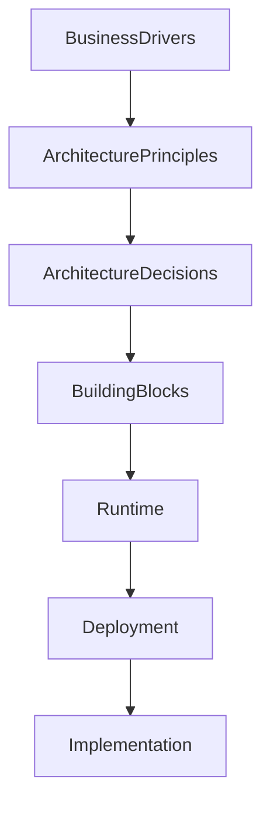

# Chapter 05
# Architecture Drivers

---

# 1. Purpose

This chapter defines the business, technical, operational, and quality drivers that influence the architecture of the Oracle Dynamic Application Framework (ODAF).

Architecture drivers represent the primary motivations behind architectural decisions and establish the rationale for the platform's overall design.

Every significant architectural decision SHALL be traceable to one or more architecture drivers.

---

# 2. Scope

This chapter defines:

- business drivers;
- technical drivers;
- quality drivers;
- operational drivers;
- strategic drivers;
- architecture priorities;
- driver traceability.

This chapter does not define implementation details.

---

# 3. Definition

An Architecture Driver is any requirement, business objective, technical constraint, quality attribute, or strategic goal that significantly influences the architecture of ODAF.

Architecture drivers SHALL provide justification for architectural decisions.

Architecture drivers SHALL remain stable unless business strategy changes.

---

# 4. Driver Categories

ODAF classifies architecture drivers into five categories.

| Category | Description |
|----------|-------------|
| Business Driver | Business objectives |
| Technical Driver | Technology motivations |
| Quality Driver | Quality attributes |
| Operational Driver | Operational concerns |
| Strategic Driver | Long-term platform evolution |

---

# 5. Business Drivers

The following business drivers define why ODAF exists.

---

## BD-001 — Reduce Repetitive Development

Enterprise systems repeatedly implement similar CRUD modules.

ODAF SHALL eliminate repetitive implementation by providing metadata-driven application generation.

Priority:

Critical

---

## BD-002 — Accelerate Delivery

Organizations require faster application delivery without sacrificing quality.

ODAF SHALL reduce development effort through metadata and standardized runtime services.

Priority:

Critical

---

## BD-003 — Standardize Enterprise Applications

Enterprise applications SHOULD present a consistent user experience.

Standardization SHALL reduce maintenance costs and training effort.

Priority:

High

---

## BD-004 — Reduce Technical Debt

Duplicated source code increases maintenance cost.

ODAF SHALL centralize common functionality into reusable platform services.

Priority:

High

---

## BD-005 — Improve Governance

Architectural consistency SHALL be maintained through centralized metadata, governance, and documented architectural decisions.

Priority:

High

---

# 6. Technical Drivers

---

## TD-001 — Metadata First

Metadata SHALL define application behavior.

Source code SHALL implement metadata.

---

## TD-002 — Compilation

Metadata SHALL be compiled before runtime execution.

Compilation SHALL validate, optimize, and prepare runtime artifacts.

---

## TD-003 — Runtime Independence

Business applications SHALL remain independent of rendering technologies.

Supported presentation channels MAY include:

- Web
- REST API
- Mobile
- Desktop

---

## TD-004 — Plugin Architecture

The platform SHALL support extensibility through published extension points.

Core components SHALL remain independent of plugins.

---

## TD-005 — Oracle as Metadata Repository

Oracle Database SHALL be the authoritative metadata repository.

Metadata SHALL be version controlled.

---

# 7. Quality Drivers

The following quality drivers significantly influence the architecture.

---

## QA-001 — Maintainability

The platform SHALL remain maintainable over long periods.

Changes SHOULD affect metadata before implementation.

---

## QA-002 — Extensibility

New capabilities SHOULD be introduced through plugins whenever practical.

---

## QA-003 — Scalability

The runtime SHALL support horizontal scaling.

---

## QA-004 — Reliability

Platform failures SHALL be isolated whenever possible.

---

## QA-005 — Security

Authorization SHALL be enforced before business execution.

---

## QA-006 — Performance

Metadata compilation SHALL minimize runtime overhead.

---

## QA-007 — Observability

Runtime SHALL expose metrics, logs, and traces.

---

# 8. Operational Drivers

Operational requirements influence deployment architecture.

---

## OP-001 — Continuous Deployment

The platform SHALL support automated deployment.

---

## OP-002 — Monitoring

Platform health SHALL be observable.

---

## OP-003 — Backup and Recovery

Metadata SHALL be recoverable.

---

## OP-004 — Version Management

Metadata versions SHALL be traceable.

---

# 9. Strategic Drivers

Long-term objectives shape the future evolution of ODAF.

---

## ST-001 — Low-Code Development

Business applications SHOULD require minimal handwritten source code.

---

## ST-002 — Platform Longevity

Architecture SHALL remain stable for long-term enterprise adoption.

---

## ST-003 — Multi-Application Support

The platform SHALL support multiple applications from a single metadata repository.

---

## ST-004 — Multi-Tenant Readiness

Future versions SHOULD support multi-tenant deployment.

---

## ST-005 — AI-Assisted Development

Future versions MAY integrate AI-assisted metadata authoring and application generation.

---

# 10. Driver Prioritization

Architecture drivers are prioritized as follows.

| Priority | Meaning |
|----------|---------|
| Critical | Mandatory architectural objective |
| High | Strong architectural influence |
| Medium | Important but negotiable |
| Low | Optional consideration |

Critical drivers SHALL take precedence when architectural conflicts occur.

---

# 11. Driver Relationships

Architecture drivers influence multiple architectural decisions.

---

# 12. Driver Traceability

Every architecture decision SHALL reference one or more architecture drivers.

Example:

| Driver | Influences |
|--------|------------|
| BD-001 | Metadata Repository, Compiler |
| TD-002 | Compiler, Runtime |
| QA-003 | Deployment Architecture |
| ST-001 | ODAF Studio |

This traceability SHALL be maintained throughout the lifecycle of the platform.

---

# 13. Risks

Failure to identify architecture drivers may result in:

- inconsistent architecture;
- unnecessary complexity;
- conflicting design decisions;
- reduced maintainability;
- inability to satisfy business objectives.

---

# 14. Summary

Architecture drivers define the primary motivations that shape the ODAF platform.

Business goals, technical requirements, quality attributes, operational needs, and long-term strategy collectively influence every architectural decision documented throughout this specification.

All Architecture Decision Records (ADR) SHALL be traceable to one or more architecture drivers.

---

# Next Document

➡ **06-Quality-Attributes.md**

The next chapter defines the quality attribute scenarios that establish measurable architectural goals for availability, maintainability, scalability, performance, security, interoperability, and observability.