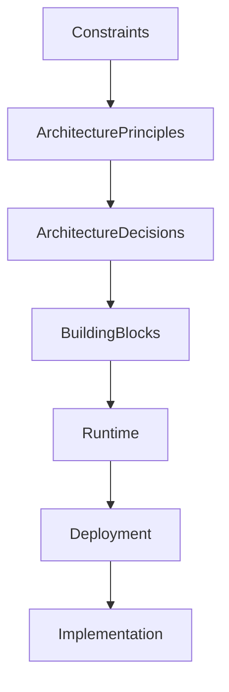

# Chapter 07
# Architecture Constraints

---

# 1. Purpose

This chapter defines the architectural constraints that govern the design and implementation of the Oracle Dynamic Application Framework (ODAF).

Constraints represent mandatory conditions, limitations, standards, and external factors that SHALL be respected throughout the lifecycle of the platform.

Architectural decisions SHALL NOT violate the constraints defined in this chapter unless an approved Architecture Decision Record (ADR) explicitly documents the exception.

---

# 2. Scope

This chapter defines:

- business constraints;
- technical constraints;
- operational constraints;
- security constraints;
- regulatory constraints;
- architectural constraints;
- technology constraints.

Implementation-specific constraints MAY be introduced by individual projects but SHALL NOT contradict this specification.

---

# 3. Constraint Categories

ODAF classifies constraints into the following categories.

| Prefix | Category |
|---------|----------|
| BC | Business Constraint |
| AC | Architectural Constraint |
| TC | Technical Constraint |
| OC | Operational Constraint |
| SC | Security Constraint |
| RC | Regulatory Constraint |

Each constraint SHALL have a unique identifier.

---

# 4. Business Constraints

## BC-001 — Metadata-Driven Development

All business applications SHALL be defined through metadata.

Business logic SHALL NOT be implemented directly within presentation components.

Priority:

Critical

---

## BC-002 — Configuration Before Coding

Whenever practical, new functionality SHALL be introduced through metadata configuration rather than custom source code.

Priority:

Critical

---

## BC-003 — Standardized User Experience

Applications generated by ODAF SHALL follow a consistent interaction model.

The framework SHALL standardize:

- navigation;
- forms;
- tables;
- dialogs;
- validation messages.

Priority:

High

---

## BC-004 — Enterprise Reuse

Reusable platform services SHALL be preferred over application-specific implementations.

Priority:

High

---

# 5. Architectural Constraints

## AC-001 — Metadata Repository

Oracle Database SHALL be the authoritative repository for application metadata.

---

## AC-002 — Compiled Metadata

Runtime SHALL consume compiled metadata.

Editable metadata SHALL NOT be interpreted directly during production request processing.

---

## AC-003 — Layer Separation

The following layers SHALL remain independent.

- Metadata
- Compiler
- Runtime
- Renderer
- Security
- Workflow
- Dataset
- Presentation

---

## AC-004 — Loose Coupling

Subsystems SHALL communicate through published interfaces only.

---

## AC-005 — Deterministic Runtime

Given identical metadata and input, runtime behavior SHALL be deterministic.

---

## AC-006 — Metadata Versioning

Metadata SHALL be version controlled.

Historical versions SHALL remain recoverable.

---

# 6. Technical Constraints

## TC-001 — Database Platform

Oracle Database is the normative metadata repository.

---

## TC-002 — Database Access

Database access SHALL occur exclusively through the Dataset Engine.

Presentation components SHALL NOT execute SQL directly.

---

## TC-003 — Stateless Runtime

Runtime services SHOULD remain stateless whenever practical.

---

## TC-004 — API Style

Public services SHOULD expose REST APIs.

Additional protocols MAY be supported.

---

## TC-005 — UTF-8 Encoding

All textual metadata SHALL use UTF-8 encoding.

---

## TC-006 — Time Standard

Timestamps SHALL follow ISO 8601.

UTC SHOULD be used for platform-level timestamps.

---

# 7. Operational Constraints

## OC-001 — High Availability

The platform SHOULD support high availability deployment.

---

## OC-002 — Backup

Metadata SHALL be included in routine backup procedures.

---

## OC-003 — Disaster Recovery

Recovery procedures SHALL be documented.

---

## OC-004 — Monitoring

Platform health SHALL be observable.

---

## OC-005 — Logging

Critical runtime events SHALL be logged.

---

# 8. Security Constraints

## SC-001 — Authentication

Every user SHALL be authenticated before accessing protected resources.

---

## SC-002 — Authorization

Authorization SHALL precede business execution.

---

## SC-003 — Least Privilege

Permissions SHALL follow the principle of least privilege.

---

## SC-004 — Audit

Security-sensitive operations SHALL be auditable.

---

## SC-005 — Secure Communication

External communication SHOULD use TLS.

---

# 9. Regulatory Constraints

## RC-001 — Audit Retention

Audit records SHALL be retained according to organizational policy.

---

## RC-002 — Data Privacy

Personally identifiable information SHALL be protected.

---

## RC-003 — Data Integrity

Business data SHALL maintain transactional consistency.

---

# 10. Technology Constraints

The following technologies constitute the reference implementation.

| Layer | Technology |
|--------|------------|
| Metadata Repository | Oracle Database |
| Backend | PHP |
| Frontend | Web Browser |
| Documentation | Markdown |
| Diagrams | Mermaid |
| Version Control | Git |

Alternative technologies MAY be supported provided architectural compatibility is maintained.

---

# 11. Constraint Relationships

Constraints influence architectural decisions.



Every Architecture Decision Record SHALL reference one or more applicable constraints.

---

# 12. Constraint Conflicts

Conflicts between constraints SHALL be resolved through the Architecture Decision Record (ADR) process.

The Architecture Board SHALL determine:

- applicable priorities;
- acceptable trade-offs;
- long-term architectural impact.

---

# 13. Constraint Traceability

Each constraint SHALL be traceable to:

- business objectives;
- architecture principles;
- architecture decisions;
- implementation artifacts;
- verification procedures.

Example:

```text
BC-001
    ↓
Metadata Repository
    ↓
Compiler
    ↓
Runtime
    ↓
Application
```

---

# 14. Risks

Failure to respect architectural constraints may result in:

- inconsistent architecture;
- increased maintenance cost;
- security vulnerabilities;
- platform fragmentation;
- reduced interoperability;
- loss of architectural integrity.

---

# 15. Summary

Architectural constraints define the boundaries within which ODAF evolves.

These constraints ensure that implementation teams make consistent decisions while preserving the long-term integrity, maintainability, and scalability of the platform.

All future architectural decisions SHALL conform to the constraints established in this chapter unless formally superseded through an approved Architecture Decision Record.

---

# Next Document

➡ **08-Context-View.md**

The next chapter introduces the Context View of ODAF using the C4 Model. It defines system boundaries, external actors, external systems, integration points, and the architectural context in which the platform operates.