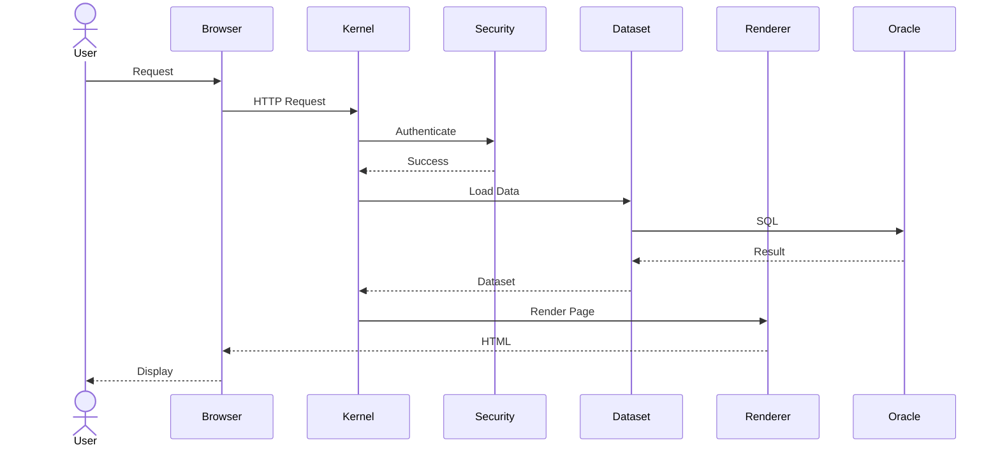

# Chapter 11
# Runtime View

---

# 1. Purpose

This chapter defines the runtime architecture of the Oracle Dynamic Application Framework (ODAF).

The Runtime View describes how the platform executes compiled metadata, coordinates architectural services, manages application lifecycle, and delivers business functionality.

The Runtime View SHALL describe runtime behavior only.

Metadata authoring is outside the scope of this chapter.

---

# 2. Scope

This chapter defines:

- runtime lifecycle;
- execution model;
- kernel architecture;
- service orchestration;
- runtime services;
- request lifecycle;
- event flow;
- transaction lifecycle.

---

# 3. Runtime Philosophy

ODAF SHALL execute applications rather than source code.

Applications are represented by compiled runtime models.

The runtime SHALL interpret these runtime models in a deterministic manner.

Runtime SHALL remain independent from metadata authoring.

---

# 4. Runtime Architecture

The runtime architecture consists of a lightweight execution kernel surrounded by specialized runtime services.

```mermaid
flowchart TB

Browser

↓

Gateway

↓

Kernel

Kernel --> Security

Kernel --> Dataset

Kernel --> Workflow

Kernel --> Validation

Kernel --> Renderer

Kernel --> Audit

Kernel --> Notification

Kernel --> Reporting

Kernel --> Integration
```

The Kernel SHALL coordinate every request.

---

# 5. ODAF Kernel

The ODAF Kernel is the central execution component.

The Kernel SHALL coordinate every runtime service.

The Kernel SHALL NOT contain business logic.

Business behavior SHALL originate from compiled metadata.

---

## Kernel Responsibilities

The Kernel SHALL provide:

- request lifecycle;
- service orchestration;
- dependency resolution;
- object lifecycle;
- runtime configuration;
- transaction coordination;
- execution scheduling;
- extension loading.

---

# 6. Runtime Lifecycle

Every request follows a deterministic lifecycle.

```text
Request

↓

Authentication

↓

Authorization

↓

Metadata Loading

↓

Object Resolution

↓

Validation

↓

Business Execution

↓

Rendering

↓

Audit

↓

Response
```

Every request SHALL complete this lifecycle.

---

# 7. Request Processing

Request processing SHALL be coordinated exclusively by the Kernel.

Request processing consists of:

1. receive request;

2. identify application;

3. resolve page;

4. load compiled metadata;

5. authenticate user;

6. authorize request;

7. instantiate runtime objects;

8. execute business action;

9. render response;

10. write audit log;

11. release resources.

---

# 8. Runtime Services

The runtime consists of specialized services.

| Service | Responsibility |
|-----------|----------------|
| Metadata Loader | Loads compiled metadata |
| Object Factory | Creates runtime objects |
| Dependency Resolver | Resolves dependencies |
| Security Service | Authentication and Authorization |
| Dataset Service | Data access |
| Workflow Service | Workflow execution |
| Validation Service | Business validation |
| Rendering Service | UI rendering |
| Audit Service | Audit logging |
| Notification Service | Notification delivery |
| Reporting Service | Report generation |
| Integration Service | External communication |

---

# 9. Metadata Loading

The runtime SHALL load compiled metadata only.

Editable metadata SHALL NOT participate in runtime execution.

Compiled metadata SHALL be immutable.

Metadata loading SHOULD be cached whenever practical.

---

# 10. Object Lifecycle

Runtime objects SHALL be created through the Object Factory.

Object lifecycle consists of:

```text
Create

↓

Initialize

↓

Inject Dependencies

↓

Execute

↓

Dispose
```

Objects SHALL NOT retain unnecessary state after request completion.

---

# 11. Dependency Resolution

Dependencies SHALL be resolved by the Dependency Resolver.

Circular dependencies SHALL be rejected.

Service implementations SHALL remain replaceable through published interfaces.

---

# 12. Event Processing

Runtime communication SHALL be event-driven whenever practical.

Typical runtime events include:

- Application Started
- Request Received
- User Authenticated
- Dataset Loaded
- Validation Completed
- Workflow Executed
- Notification Sent
- Report Generated
- Request Completed

Event handlers SHALL remain independent.

---

# 13. Transaction Management

Business execution SHALL occur inside managed transactions.

The Kernel SHALL coordinate:

- transaction begin;
- commit;
- rollback;
- retry.

Nested transaction behavior SHALL be documented in Volume 3.

---

# 14. Error Handling

Errors SHALL be classified into:

| Category | Example |
|----------|----------|
| Validation | Invalid metadata |
| Authorization | Access denied |
| Business | Workflow error |
| Runtime | Service failure |
| Integration | REST timeout |
| Infrastructure | Database unavailable |

Unhandled exceptions SHALL be logged.

Sensitive information SHALL NOT be exposed to end users.

---

# 15. Runtime State

The runtime SHOULD remain stateless.

Persistent state SHALL reside in:

- Oracle Database;
- distributed cache;
- session store;
- workflow repository.

Stateless services improve scalability.

---

# 16. Runtime Extensibility

The Kernel SHALL expose extension points.

Supported extension categories include:

- custom renderer;
- custom validator;
- dataset provider;
- notification provider;
- authentication provider;
- workflow action.

Extensions SHALL be isolated from Kernel implementation.

---

# 17. Runtime Sequence

The following sequence illustrates a typical page request.



---

# 18. Runtime Principles

The runtime SHALL satisfy the following principles.

- deterministic execution;
- metadata-driven behavior;
- stateless services;
- centralized orchestration;
- service isolation;
- extension through interfaces;
- auditability;
- scalability.

---

# 19. Runtime Traceability

The Runtime View is related to:

- Chapter 10 — Building Block View
- Chapter 12 — Deployment View
- Volume 2 — Metadata Repository
- Volume 3 — Runtime Implementation

Every runtime service SHALL correspond to one architectural building block.

---

# 20. Summary

The Runtime View defines how ODAF executes compiled applications.

The Kernel coordinates specialized runtime services, manages request lifecycle, orchestrates transactions, resolves dependencies, and executes business functionality in a deterministic manner.

This architecture enables ODAF to remain scalable, maintainable, extensible, and independent of specific implementation technologies.

---

# Next Document

➡ **12-Deployment-View.md**

The next chapter defines the physical deployment architecture of ODAF, including runtime nodes, clustering, network topology, deployment environments, scalability, high availability, and operational infrastructure.