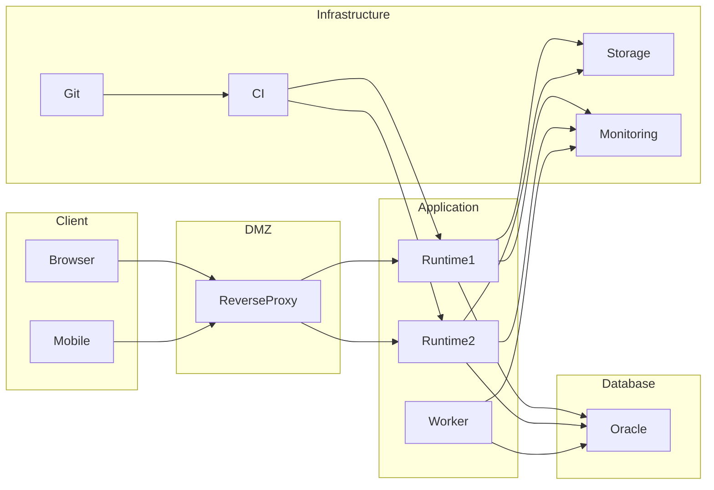

# Chapter 12
# Deployment View

---

# 1. Purpose

This chapter defines the physical deployment architecture of the Oracle Dynamic Application Framework (ODAF).

The Deployment View describes how ODAF is deployed onto physical or virtual infrastructure, how runtime services interact across deployment nodes, and how the platform supports scalability, high availability, operational resilience, and future cloud-native environments.

This chapter follows:

- ISO/IEC/IEEE 42010
- arc42 Deployment View
- C4 Deployment Diagram

---

# 2. Scope

This chapter defines:

- deployment topology;
- execution nodes;
- runtime infrastructure;
- network zones;
- deployment environments;
- clustering;
- scalability;
- high availability;
- disaster recovery;
- operational deployment principles.

Implementation procedures are defined in Volume 3.

---

# 3. Deployment Philosophy

ODAF SHALL separate:

- development;
- testing;
- staging;
- production.

Deployment SHALL occur using compiled metadata packages.

Runtime SHALL remain immutable after deployment.

Business applications SHALL evolve through metadata deployment rather than runtime modification.

---

# 4. Deployment Environments

The platform recognizes the following environments.

| Environment | Purpose |
|-------------|---------|
| Development | Metadata authoring |
| Integration | Team integration |
| Testing | Functional verification |
| Staging | Production validation |
| Production | Business operation |

Each environment SHALL remain independently deployable.

---

# 5. Deployment Nodes

The logical deployment consists of the following nodes.

| Node | Responsibility |
|------|----------------|
| Client Node | User interaction |
| Reverse Proxy | HTTPS termination and routing |
| ODAF Runtime Node | Application execution |
| Background Worker | Asynchronous processing |
| Oracle Database Node | Metadata and business data |
| File Storage Node | Binary storage |
| Monitoring Node | Metrics and logging |
| CI/CD Node | Build and deployment |

---

# 6. Reference Deployment Architecture



---

# 7. Runtime Cluster

Runtime nodes SHALL support horizontal scaling.

Example:

```text
Runtime Node 1

Runtime Node 2

Runtime Node 3

Runtime Node n
```

Each node SHALL execute the same compiled metadata.

Runtime nodes SHALL remain stateless.

---

# 8. Oracle Database Deployment

Oracle Database serves as the authoritative repository for:

- metadata;
- business data;
- audit logs;
- deployment history;
- workflow state.

Oracle SHALL support:

- backup;
- recovery;
- replication;
- high availability.

---

# 9. Storage Architecture

Binary content SHALL NOT be stored inside metadata definitions.

Typical storage includes:

- document repository;
- report output;
- attachments;
- exported files;
- imported files.

Object Storage SHOULD be preferred whenever practical.

---

# 10. Network Zones

The deployment architecture recognizes the following security zones.

```text
Internet

↓

DMZ

↓

Application Network

↓

Database Network

↓

Backup Network
```

Communication between zones SHALL be controlled through security policies.

---

# 11. High Availability

The deployment SHALL support:

- multiple runtime nodes;
- redundant reverse proxies;
- Oracle HA technologies;
- monitoring;
- automatic restart.

No single runtime node SHALL constitute a mandatory point of failure.

---

# 12. Scalability

The platform SHALL support horizontal scalability.

Supported scaling strategies include:

- runtime replication;
- worker replication;
- load balancing;
- distributed cache.

Metadata SHALL remain consistent across all runtime nodes.

---

# 13. Disaster Recovery

Recovery procedures SHALL include:

- Oracle backup;
- metadata backup;
- attachment backup;
- deployment package backup;
- configuration backup.

Recovery objectives SHALL be defined by deployment policy.

---

# 14. Deployment Pipeline

Deployment SHALL follow the sequence below.

```text
Metadata Authoring

↓

Validation

↓

Compilation

↓

Package

↓

Testing

↓

Approval

↓

Deployment

↓

Activation
```

No runtime SHALL execute unpublished metadata.

---

# 15. Deployment Packages

Deployment packages SHALL contain:

- compiled metadata;
- dependency manifest;
- version information;
- compatibility information;
- checksum.

Deployment packages SHALL be immutable.

---

# 16. Monitoring

Every deployment SHALL expose operational telemetry.

Minimum telemetry includes:

- runtime health;
- response time;
- request count;
- active sessions;
- error count;
- CPU usage;
- memory usage.

Monitoring SHALL support proactive operational management.

---

# 17. Security Considerations

Deployment SHALL support:

- HTTPS;
- TLS;
- secure secrets management;
- encrypted credentials;
- network isolation;
- least privilege.

Production credentials SHALL NOT be embedded inside deployment packages.

---

# 18. Deployment Traceability

Every deployment SHALL be traceable.

Deployment history SHALL record:

- package version;
- deployment time;
- deployed by;
- environment;
- rollback information.

Deployment records SHALL be retained for audit purposes.

---

# 19. Risks

Potential deployment risks include:

- network failure;
- Oracle outage;
- storage failure;
- configuration drift;
- inconsistent metadata versions;
- incomplete deployment.

Deployment automation SHOULD minimize these risks.

---

# 20. Summary

The Deployment View defines the physical architecture of the ODAF platform.

The architecture separates runtime execution from metadata authoring, supports horizontal scalability, enables high availability, and provides a secure, traceable deployment model suitable for enterprise environments.

The following chapter introduces the Cross-Cutting Concepts that apply uniformly across every architectural layer of ODAF.

---

# Next Document

➡ **13-Cross-Cutting-Concepts.md**

This chapter defines the cross-cutting architectural concepts shared by every building block, including configuration management, logging, caching, auditing, exception handling, localization, transaction management, observability, and platform-wide conventions.