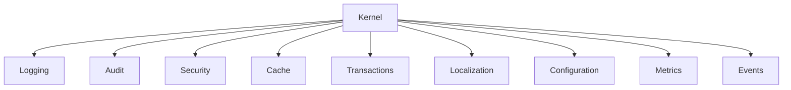

# Chapter 13
# Cross-Cutting Concepts

---

# 1. Purpose

This chapter defines the architectural concepts that apply uniformly across every subsystem of the Oracle Dynamic Application Framework (ODAF).

Unlike functional building blocks, cross-cutting concepts are shared capabilities that influence the behavior, consistency, security, maintainability, and operational characteristics of the entire platform.

Every implementation SHALL conform to these concepts.

---

# 2. Scope

This chapter defines platform-wide concepts including:

- configuration management;
- dependency injection;
- logging;
- auditing;
- exception handling;
- transaction management;
- caching;
- localization;
- observability;
- security;
- versioning;
- concurrency;
- lifecycle management.

---

# 3. Design Principles

Cross-cutting concepts SHALL:

- be centralized;
- be reusable;
- be technology-independent whenever practical;
- minimize duplicated implementation;
- be accessible through published interfaces.

Business modules SHALL NOT implement these concepts independently.

---

# 4. Configuration Management

Platform configuration SHALL be centralized.

Configuration categories include:

- application configuration;
- environment configuration;
- runtime configuration;
- security configuration;
- deployment configuration.

Configuration SHALL support environment-specific values without changing application metadata.

---

# 5. Dependency Injection

ODAF SHALL adopt Dependency Injection (DI) for runtime service composition.

The Kernel SHALL resolve service dependencies through the Service Registry.

Benefits include:

- loose coupling;
- easier testing;
- extensibility;
- service replacement.

Business modules SHALL NOT instantiate platform services directly.

---

# 6. Logging

Platform logging SHALL be standardized.

Every log entry SHOULD include:

- timestamp;
- severity;
- component;
- request identifier;
- user identifier (when applicable);
- correlation identifier;
- message.

Supported severity levels include:

| Level | Description |
|--------|-------------|
| TRACE | Detailed diagnostic information |
| DEBUG | Development diagnostics |
| INFO | Informational events |
| WARN | Recoverable issues |
| ERROR | Application errors |
| FATAL | Critical platform failures |

Logging SHALL be configurable.

---

# 7. Auditing

Auditing SHALL be enabled by default.

The Audit Engine SHALL record:

- login/logout;
- CRUD operations;
- permission changes;
- workflow actions;
- deployment activities;
- configuration changes.

Audit records SHALL be immutable.

---

# 8. Exception Handling

Exceptions SHALL be categorized.

| Category | Description |
|----------|-------------|
| ValidationException | Invalid input or metadata |
| SecurityException | Authentication or authorization failure |
| BusinessException | Business rule violation |
| IntegrationException | External system failure |
| InfrastructureException | Platform or database failure |
| SystemException | Unexpected runtime error |

Sensitive information SHALL NOT be exposed to end users.

---

# 9. Transaction Management

Transactions SHALL be coordinated by the ODAF Kernel.

The platform SHALL support:

- transaction begin;
- commit;
- rollback;
- retry;
- compensation (future enhancement).

Business modules SHALL NOT manage database transactions directly.

---

# 10. Caching

Caching SHALL improve runtime performance while preserving consistency.

Cache categories include:

- compiled metadata cache;
- configuration cache;
- permission cache;
- lookup cache;
- dataset cache.

Caches SHALL support explicit invalidation.

---

# 11. Localization

The platform SHALL support internationalization (i18n) and localization (l10n).

Localizable elements include:

- labels;
- messages;
- captions;
- validation texts;
- report titles;
- menu names.

Localization SHALL be metadata-driven.

---

# 12. Security

Security SHALL be enforced consistently across all platform components.

Core principles include:

- authentication before authorization;
- least privilege;
- defense in depth;
- secure defaults;
- centralized permission evaluation.

Security SHALL NOT depend on UI implementation.

---

# 13. Versioning

The platform SHALL version:

- metadata;
- deployment packages;
- runtime model;
- APIs;
- plugins.

Version compatibility SHALL be validated during deployment.

---

# 14. Concurrency

Runtime services SHALL support concurrent execution.

Shared mutable state SHALL be minimized.

Thread safety SHALL be considered for all shared services.

Long-running processes SHOULD execute asynchronously where appropriate.

---

# 15. Lifecycle Management

Platform components SHALL follow a defined lifecycle.

```text
Register

↓

Initialize

↓

Start

↓

Execute

↓

Stop

↓

Dispose
```

The Kernel SHALL coordinate lifecycle transitions.

---

# 16. Observability

The platform SHALL expose operational telemetry.

Observability includes:

- logs;
- metrics;
- traces;
- health checks;
- audit events.

Observability SHALL support integration with enterprise monitoring platforms.

---

# 17. Platform Events

Cross-cutting services MAY publish events.

Examples include:

- UserAuthenticated
- MetadataCompiled
- DeploymentCompleted
- WorkflowFinished
- DatasetLoaded
- ReportGenerated

Event publication SHALL be asynchronous whenever practical.

---

# 18. Cross-Cutting Relationships



All platform services SHALL remain independent of business modules.

---

# 19. Traceability

Every building block SHALL adopt the cross-cutting concepts defined in this chapter.

Examples:

| Building Block | Cross-Cutting Concepts |
|----------------|------------------------|
| Runtime | Logging, Transactions, Security |
| Dataset | Cache, Logging, Transactions |
| Workflow | Audit, Events, Security |
| Renderer | Localization, Logging |
| Deployment | Audit, Versioning |

Traceability SHALL be maintained throughout implementation.

---

# 20. Risks

Failure to centralize cross-cutting concerns may result in:

- duplicated implementation;
- inconsistent behavior;
- fragmented security;
- difficult maintenance;
- poor observability;
- increased technical debt.

The Architecture Board SHALL ensure that cross-cutting concerns remain centralized.

---

# 21. Summary

Cross-cutting concepts provide the common architectural foundation shared by every ODAF subsystem.

By centralizing configuration, logging, auditing, transactions, caching, localization, observability, and security, ODAF ensures consistency, maintainability, scalability, and operational excellence across the platform.

These concepts SHALL be realized through reusable platform services in the ODAF Kernel and SHALL be applied uniformly across all implementations.

---

# Next Document

➡ **14-Architecture-Principles.md**

The next chapter defines the fundamental architectural principles that govern every design decision, implementation, extension, and evolution of the Oracle Dynamic Application Framework.