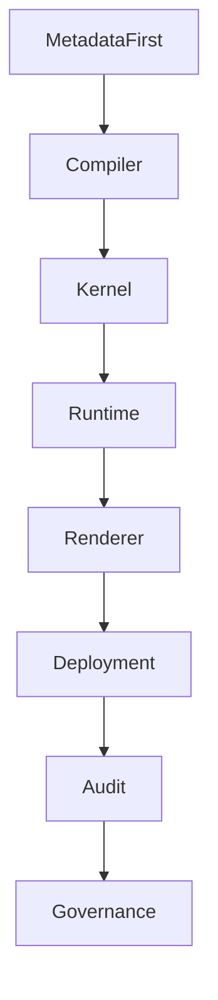

# Chapter 14
# Architecture Principles

---

# 1. Purpose

This chapter defines the fundamental architectural principles governing the Oracle Dynamic Application Framework (ODAF).

Architecture Principles establish mandatory rules that guide architectural decisions, implementation strategies, technology selection, extension mechanisms, deployment models, and future evolution of the platform.

Every implementation claiming ODAF compatibility SHALL conform to these principles.

---

# 2. Scope

This chapter defines:

- architecture principles;
- rationale;
- implications;
- principle classification;
- compliance expectations.

These principles apply across all ODAF volumes and implementations.

---

# 3. Principle Structure

Every architectural principle consists of:

| Element | Description |
|---------|-------------|
| Principle ID | Unique identifier |
| Name | Principle name |
| Statement | Mandatory architectural rule |
| Rationale | Why the principle exists |
| Implications | Consequences for implementation |

---

# 4. Principle Categories

ODAF classifies principles into the following categories.

| Prefix | Category |
|---------|----------|
| AP | Architecture |
| MP | Metadata |
| KP | Kernel |
| SP | Security |
| DP | Deployment |
| EP | Extensibility |
| OP | Operational |

---

# 5. AP-001 — Metadata First

## Statement

Business applications SHALL be defined primarily through metadata.

## Rationale

Metadata provides consistency, maintainability, and enables declarative application development.

## Implications

- Business behavior is metadata-driven.
- Runtime executes compiled metadata.
- Source code focuses on platform capabilities.

---

# 6. AP-002 — Compilation Before Execution

## Statement

Editable metadata SHALL be compiled before runtime execution.

## Rationale

Compilation enables validation, optimization, dependency analysis, and deterministic execution.

## Implications

- Runtime never interprets editable metadata directly.
- Invalid metadata is rejected during compilation.
- Runtime executes immutable runtime artifacts.

---

# 7. AP-003 — Separation of Concerns

## Statement

Each architectural building block SHALL have exactly one primary responsibility.

## Rationale

Separation of concerns minimizes coupling and improves maintainability.

## Implications

- Renderer contains no business logic.
- Dataset Engine owns data access.
- Workflow Engine owns process execution.
- Security Engine owns authorization.

---

# 8. AP-004 — Loose Coupling

## Statement

Subsystems SHALL communicate only through published contracts.

## Rationale

Loose coupling simplifies maintenance and enables replacement of implementations.

## Implications

- Direct dependencies are minimized.
- Extension points become stable contracts.
- Internal implementation remains encapsulated.

---

# 9. AP-005 — Deterministic Execution

## Statement

Identical metadata and identical inputs SHALL produce identical runtime behavior.

## Rationale

Deterministic execution improves reliability, testing, auditing, and reproducibility.

## Implications

- Runtime behavior is predictable.
- Metadata compilation is repeatable.
- Audit trails remain consistent.

---

# 10. AP-006 — Security by Design

## Statement

Security SHALL be enforced by the platform rather than individual applications.

## Rationale

Centralized security reduces implementation errors and improves consistency.

## Implications

- Authentication precedes authorization.
- Permissions are metadata-driven.
- Security policies are centrally managed.

---

# 11. AP-007 — Audit by Default

## Statement

Architecturally significant operations SHALL be auditable.

## Rationale

Auditability is essential for enterprise governance and compliance.

## Implications

The Audit Engine records:

- authentication events;
- CRUD operations;
- workflow actions;
- deployments;
- permission changes.

---

# 12. AP-008 — Stateless Runtime

## Statement

Runtime services SHOULD remain stateless whenever practical.

## Rationale

Stateless services improve scalability and simplify deployment.

## Implications

- Horizontal scaling becomes straightforward.
- Runtime nodes remain interchangeable.
- State is externalized.

---

# 13. AP-009 — Extensibility First

## Statement

Platform evolution SHOULD occur through extension mechanisms instead of core modification.

## Rationale

Stable platform cores reduce technical debt.

## Implications

- Plugins are preferred.
- Extension points are published.
- Kernel remains stable.

---

# 14. AP-010 — Configuration over Customization

## Statement

Configuration SHALL be preferred over application-specific customization.

## Rationale

Configuration promotes consistency and reduces maintenance.

## Implications

- Metadata replaces repetitive coding.
- Platform behavior is standardized.
- Upgrade paths remain simpler.

---

# 15. AP-011 — Version Everything

## Statement

Every significant platform artifact SHALL be versioned.

## Rationale

Versioning supports traceability and controlled evolution.

## Implications

The following SHALL be versioned:

- metadata;
- deployment packages;
- plugins;
- APIs;
- documentation.

---

# 16. AP-012 — Immutable Deployment

## Statement

Runtime environments SHALL execute immutable deployment packages.

## Rationale

Immutable deployments simplify rollback, auditing, and operational consistency.

## Implications

- No runtime editing.
- Deployment packages are signed.
- Rollback uses previous package versions.

---

# 17. AP-013 — Interface-Driven Architecture

## Statement

Platform components SHALL depend upon interfaces rather than implementations.

## Rationale

Interface-driven architecture enables modularity and independent evolution.

## Implications

- Components become replaceable.
- Testing becomes easier.
- Plugins remain compatible.

---

# 18. AP-014 — Backward Compatibility

## Statement

Backward compatibility SHOULD be preserved whenever practical.

## Rationale

Enterprise platforms evolve over many years.

## Implications

- Metadata migration tools are required.
- Deprecated features remain supported for defined periods.
- Breaking changes require explicit migration guidance.

---

# 19. Principle Relationships

The following diagram illustrates the relationship between principles.

The principles collectively establish the architectural foundation of ODAF.

---

# 20. Principle Compliance

Every Architecture Decision Record (ADR) SHALL identify the principles it supports.

Every implementation SHALL be reviewable against these principles.

Non-conforming implementations SHALL require formal approval from the Architecture Board.

---

# 21. Risks

Ignoring architectural principles may lead to:

- inconsistent implementations;
- architectural drift;
- reduced maintainability;
- fragmented security;
- duplicated functionality;
- increased technical debt.

---

# 22. Summary

Architecture Principles define the immutable rules governing the evolution of ODAF.

These principles ensure that all implementations remain consistent, maintainable, secure, extensible, and aligned with the long-term architectural vision of the platform.

Every subsequent design decision, implementation artifact, and deployment strategy SHALL conform to the principles established in this chapter.

---

# Next Document

➡ **15-Architecture-Decisions.md**

The next chapter formalizes the Architecture Decision Record (ADR) process and documents the key architectural decisions that define the Oracle Dynamic Application Framework.