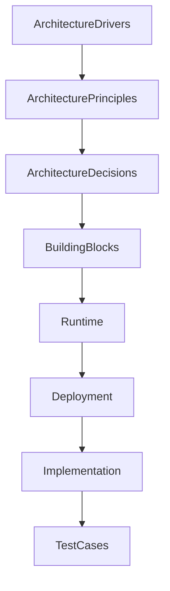

# Chapter 15
# Architecture Decisions

---

# 1. Purpose

This chapter defines the Architecture Decision Record (ADR) framework used by the Oracle Dynamic Application Framework (ODAF).

Architecture Decisions document the rationale behind significant architectural choices and provide long-term traceability between business objectives, architecture principles, implementation, and platform evolution.

Every architectural decision affecting ODAF SHALL be documented using the ADR process.

---

# 2. Scope

This chapter defines:

- Architecture Decision Record (ADR);
- ADR lifecycle;
- ADR template;
- decision authority;
- decision governance;
- decision traceability;
- initial architectural decisions.

---

# 3. Definition

An Architecture Decision Record (ADR) is a permanent document describing an important architectural decision.

Each ADR SHALL describe:

- the context;
- the problem;
- the alternatives;
- the selected solution;
- the rationale;
- the consequences.

An ADR SHALL remain immutable after publication.

Subsequent changes SHALL be documented by creating a new ADR.

---

# 4. ADR Lifecycle

Every ADR follows the lifecycle below.

```text
Proposed

↓

Under Review

↓

Accepted

↓

Implemented

↓

Superseded (Optional)

↓

Deprecated (Optional)
```

Historical ADRs SHALL remain available.

---

# 5. ADR Identification

Each Architecture Decision Record SHALL have a unique identifier.

Format:

```text
ADR-0001
ADR-0002
ADR-0003
...
```

Identifiers SHALL NOT be reused.

---

# 6. ADR Template

Every ADR SHALL include the following sections.

| Section | Description |
|----------|-------------|
| ADR ID | Unique identifier |
| Title | Decision title |
| Status | Proposed, Accepted, etc. |
| Context | Problem description |
| Decision | Selected solution |
| Alternatives | Other considered options |
| Consequences | Positive and negative impacts |
| Related Principles | Architecture Principles |
| Related Drivers | Architecture Drivers |
| Related Building Blocks | Architecture Components |
| Related Constraints | Applicable Constraints |

---

# 7. Decision Authority

Architecture Decisions SHALL be approved by the Architecture Board.

Typical decision authorities include:

| Decision Type | Authority |
|---------------|-----------|
| Enterprise Architecture | Enterprise Architect |
| Platform Architecture | Chief Software Architect |
| Database Architecture | Oracle Database Architect |
| Runtime Architecture | Runtime Architect |
| Security Architecture | Security Architect |
| Deployment Architecture | DevOps Architect |

Major decisions SHALL require Architecture Board approval.

---

# 8. Decision Categories

ODAF recognizes the following decision categories.

| Category | Description |
|----------|-------------|
| Platform | Platform architecture |
| Runtime | Runtime execution |
| Metadata | Metadata repository |
| Security | Security architecture |
| Deployment | Deployment strategy |
| Integration | External integration |
| Performance | Optimization |
| Governance | Architecture governance |

---

# 9. ADR-0001
## ODAF SHALL Adopt a Metadata-First Architecture

### Status

Accepted

### Context

Traditional enterprise systems duplicate business logic across applications.

### Decision

Business applications SHALL be defined primarily through metadata.

### Alternatives

- Code-first development
- Hybrid metadata
- Hard-coded applications

### Rationale

Metadata provides consistency, maintainability, extensibility, and centralized governance.

### Consequences

Positive:

- Reduced duplication
- Faster development
- Standardization

Negative:

- Metadata model becomes more complex.

Related Principles:

- AP-001
- AP-010

---

# 10. ADR-0002
## ODAF SHALL Compile Metadata Before Execution

### Status

Accepted

### Context

Interpreting editable metadata during runtime reduces performance and increases operational risk.

### Decision

Metadata SHALL be compiled before runtime execution.

### Alternatives

- Direct interpretation
- Partial compilation

### Consequences

Positive:

- Faster runtime
- Better validation
- Deterministic behavior

Negative:

- Compilation phase required.

Related Principles:

- AP-002
- AP-005

---

# 11. ADR-0003
## ODAF SHALL Implement a Microkernel Architecture

### Status

Accepted

### Context

Runtime services require modularity and long-term extensibility.

### Decision

The ODAF Kernel SHALL implement a Microkernel Architecture.

Platform capabilities SHALL be provided through pluggable services.

### Alternatives

- Monolithic runtime
- Layered runtime only
- Service locator architecture

### Consequences

Positive:

- High modularity
- Replaceable services
- Easier testing
- Independent evolution

Negative:

- Additional abstraction
- Service registry required

Related Principles:

- AP-003
- AP-004
- AP-009

---

# 12. ADR-0004
## Oracle SHALL Be the Authoritative Metadata Repository

### Status

Accepted

### Context

A single authoritative repository is required for metadata consistency.

### Decision

Oracle Database SHALL store all authoritative application metadata.

### Alternatives

- JSON files
- XML files
- Distributed metadata stores

### Consequences

Positive:

- Transaction consistency
- Central governance
- Enterprise scalability

Negative:

- Oracle dependency

Related Principles:

- AP-001
- AP-011

---

# 13. ADR-0005
## Runtime SHALL Execute Immutable Deployment Packages

### Status

Accepted

### Context

Mutable runtime environments complicate deployment and rollback.

### Decision

Runtime SHALL execute immutable compiled deployment packages.

### Alternatives

- Live metadata editing
- Runtime interpretation

### Consequences

Positive:

- Predictable deployment
- Rollback capability
- Auditability

Negative:

- Deployment process required

Related Principles:

- AP-012

---

# 14. ADR Relationships

Architecture Decisions influence every architectural layer.



Every implementation SHALL reference one or more ADRs.

---

# 15. ADR Governance

The Architecture Board SHALL maintain the ADR repository.

Responsibilities include:

- approving ADRs;
- reviewing proposed changes;
- resolving architectural conflicts;
- retiring obsolete decisions;
- preserving historical traceability.

---

# 16. Decision Traceability

Every ADR SHALL be traceable to:

- Architecture Drivers;
- Architecture Principles;
- Constraints;
- Building Blocks;
- Oracle Metadata;
- Runtime Components;
- Deployment Packages;
- Test Cases.

Example:

```text
ADR-0003
    │
    ▼
Kernel
    │
    ▼
Service Registry
    │
    ▼
Runtime
```

---

# 17. Risks

Failure to document architectural decisions may result in:

- inconsistent implementation;
- undocumented assumptions;
- architectural drift;
- repeated design discussions;
- loss of architectural knowledge.

The ADR process mitigates these risks.

---

# 18. Summary

Architecture Decision Records preserve the reasoning behind the evolution of ODAF.

By documenting architectural context, alternatives, decisions, rationale, and consequences, the platform establishes long-term architectural traceability and governance.

All future architectural changes SHALL be managed through the ADR process defined in this chapter.

---

# Next Document

➡ **16-Conformance.md**

The next chapter defines the ODAF conformance model, compliance levels, verification process, certification criteria, and implementation validation requirements.