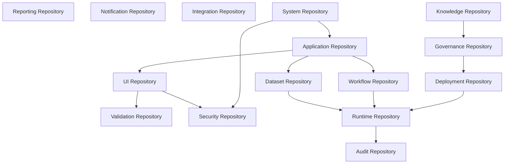

# Chapter 02
# Repository Overview

---

# 1. Purpose

This chapter defines the logical organization of the Oracle Metadata Repository.

The repository is divided into multiple independent metadata domains.

Each domain owns a cohesive set of metadata objects and exposes well-defined relationships with other domains.

This decomposition improves maintainability, scalability, governance, and long-term evolution.

---

# 2. Repository Philosophy

The Oracle Metadata Repository SHALL NOT be implemented as one monolithic schema.

Instead, it SHALL be organized into logical repositories.

Each repository represents a distinct architectural responsibility.

Repositories SHALL communicate through published metadata relationships rather than implicit dependencies.

---

# 3. Repository Hierarchy

```text
Oracle Metadata Repository

├── Application Repository
├── User Interface Repository
├── Dataset Repository
├── Workflow Repository
├── Validation Repository
├── Security Repository
├── Reporting Repository
├── Notification Repository
├── Integration Repository
├── Runtime Repository
├── Deployment Repository
├── Audit Repository
├── Governance Repository
├── Knowledge Repository
└── System Repository
```

Each repository SHALL own its metadata lifecycle.

---

# 4. Repository Relationships



Relationships SHALL remain acyclic whenever practical.

---

# 5. Repository Domains

The repository consists of the following domains.

| Domain | Prefix | Responsibility |
|---------|--------|----------------|
| Application | APP_ | Applications, modules, menus, pages |
| User Interface | UI_ | Forms, tabs, panels, fields, buttons |
| Dataset | DS_ | SQL, parameters, columns, LOV |
| Workflow | WF_ | State machines and approvals |
| Validation | VAL_ | Business validation rules |
| Security | SEC_ | Users, roles, permissions |
| Reporting | RPT_ | Reports, templates, exports |
| Notification | NTF_ | Email, SMS, push notifications |
| Integration | INT_ | REST, SOAP, API connectors |
| Runtime | RT_ | Compiled runtime metadata |
| Deployment | DEP_ | Deployment packages and versions |
| Audit | AUD_ | History and audit trail |
| Governance | GOV_ | ADR, reviews, approvals |
| Knowledge | KB_ | Documentation and references |
| System | SYS_ | Platform configuration |

---

# 6. Application Repository

The Application Repository defines the structural composition of business applications.

Typical metadata includes:

- applications;
- modules;
- menus;
- pages;
- navigation hierarchy.

Prefix:

```text
APP_
```

Example objects:

```text
APP_APPLICATION
APP_MODULE
APP_MENU
APP_PAGE
APP_PAGE_GROUP
```

---

# 7. User Interface Repository

The UI Repository defines presentation metadata.

Typical metadata includes:

- forms;
- tabs;
- panels;
- groups;
- fields;
- buttons;
- layouts.

Prefix:

```text
UI_
```

---

# 8. Dataset Repository

The Dataset Repository defines all data access metadata.

Typical metadata includes:

- datasets;
- SQL definitions;
- parameters;
- joins;
- filters;
- sorting;
- paging;
- caching;
- LOV definitions.

Prefix:

```text
DS_
```

---

# 9. Workflow Repository

The Workflow Repository defines business process execution.

Typical metadata includes:

- workflows;
- states;
- actions;
- transitions;
- approvals;
- timers.

Prefix:

```text
WF_
```

---

# 10. Validation Repository

Validation metadata defines platform validation behavior.

Examples include:

- required fields;
- uniqueness;
- regular expressions;
- PL/SQL validation;
- cross-field validation;
- business rules.

Prefix:

```text
VAL_
```

---

# 11. Security Repository

Security metadata controls platform authorization.

Metadata includes:

- users;
- roles;
- permissions;
- object permissions;
- row-level security;
- session policies.

Prefix:

```text
SEC_
```

---

# 12. Reporting Repository

Reporting metadata defines report generation.

Metadata includes:

- reports;
- templates;
- layouts;
- export formats;
- scheduling.

Prefix:

```text
RPT_
```

---

# 13. Notification Repository

Notification metadata defines message delivery.

Supported channels include:

- email;
- SMS;
- push notification;
- webhook.

Prefix:

```text
NTF_
```

---

# 14. Integration Repository

Integration metadata describes communication with external systems.

Supported integrations include:

- REST;
- SOAP;
- Oracle Database Link;
- File Exchange;
- Message Queue.

Prefix:

```text
INT_
```

---

# 15. Runtime Repository

The Runtime Repository stores compiled metadata.

Editable metadata SHALL NOT be stored here.

Metadata includes:

- compiled pages;
- compiled workflows;
- compiled datasets;
- runtime object graphs.

Prefix:

```text
RT_
```

---

# 16. Deployment Repository

Deployment metadata manages application releases.

Metadata includes:

- packages;
- releases;
- environments;
- deployments;
- rollback history.

Prefix:

```text
DEP_
```

---

# 17. Audit Repository

The Audit Repository stores immutable operational history.

Examples include:

- login history;
- metadata changes;
- deployment history;
- business transactions;
- approval history.

Prefix:

```text
AUD_
```

---

# 18. Governance Repository

The Governance Repository supports architecture governance.

Metadata includes:

- architecture principles;
- ADRs;
- change requests;
- architecture reviews;
- approvals.

Prefix:

```text
GOV_
```

---

# 19. Knowledge Repository

Knowledge metadata stores reusable architectural knowledge.

Examples include:

- standards;
- references;
- coding guidelines;
- documentation;
- best practices.

Prefix:

```text
KB_
```

---

# 20. System Repository

The System Repository stores platform configuration.

Examples include:

- system parameters;
- environments;
- locales;
- scheduler configuration;
- feature flags.

Prefix:

```text
SYS_
```

---

# 21. Repository Ownership

Each repository SHALL have a single owning architectural domain.

| Repository | Owner |
|------------|-------|
| APP | Application Architecture |
| UI | UI Architecture |
| DS | Data Architecture |
| WF | Workflow Architecture |
| VAL | Business Rules Team |
| SEC | Security Architecture |
| RPT | Reporting Team |
| NTF | Integration Team |
| INT | Integration Architecture |
| RT | Runtime Team |
| DEP | DevOps Team |
| AUD | Platform Team |
| GOV | Architecture Board |
| KB | Architecture Board |
| SYS | Platform Operations |

Ownership SHALL be documented and governed.

---

# 22. Repository Design Rules

All repositories SHALL comply with the following rules.

- Every object SHALL belong to exactly one repository.
- Cross-repository references SHALL use foreign keys.
- Circular dependencies SHOULD be avoided.
- Repository boundaries SHALL remain stable.
- Metadata SHALL be versioned.
- Metadata SHALL be auditable.

---

# 23. Traceability

Every repository SHALL participate in the architecture traceability model.

```text
Architecture Principle

↓

Repository

↓

Oracle Object

↓

PL/SQL Package

↓

Runtime Service

↓

Business Application
```

---

# 24. Risks

Potential repository risks include:

- overlapping responsibilities;
- duplicate metadata;
- cyclic dependencies;
- inconsistent ownership;
- repository fragmentation.

These risks SHALL be mitigated through architecture governance and metadata validation.

---

# 25. Summary

The Oracle Metadata Repository is organized into cohesive repository domains that separate responsibilities while preserving architectural consistency.

Each repository owns a well-defined metadata scope, follows standardized naming conventions, and exposes published relationships to other repositories.

This organization enables ODAF to scale from small applications to enterprise platforms without sacrificing maintainability or governance.

---

# Repository Catalog

| Repository | Prefix | Planned Objects |
|------------|--------|----------------:|
| Application | APP_ | 15–20 |
| User Interface | UI_ | 25–35 |
| Dataset | DS_ | 20–30 |
| Workflow | WF_ | 15–25 |
| Validation | VAL_ | 10–15 |
| Security | SEC_ | 20–30 |
| Reporting | RPT_ | 10–15 |
| Notification | NTF_ | 5–10 |
| Integration | INT_ | 10–15 |
| Runtime | RT_ | 15–20 |
| Deployment | DEP_ | 10–15 |
| Audit | AUD_ | 20–30 |
| Governance | GOV_ | 10–15 |
| Knowledge | KB_ | 5–10 |
| System | SYS_ | 10–15 |

---

# Next Document

➡ **03-Domain-Model.md**

The next chapter defines the enterprise domain model, including metadata entities, aggregate boundaries, domain relationships, and ownership rules that underpin the Oracle Metadata Repository.