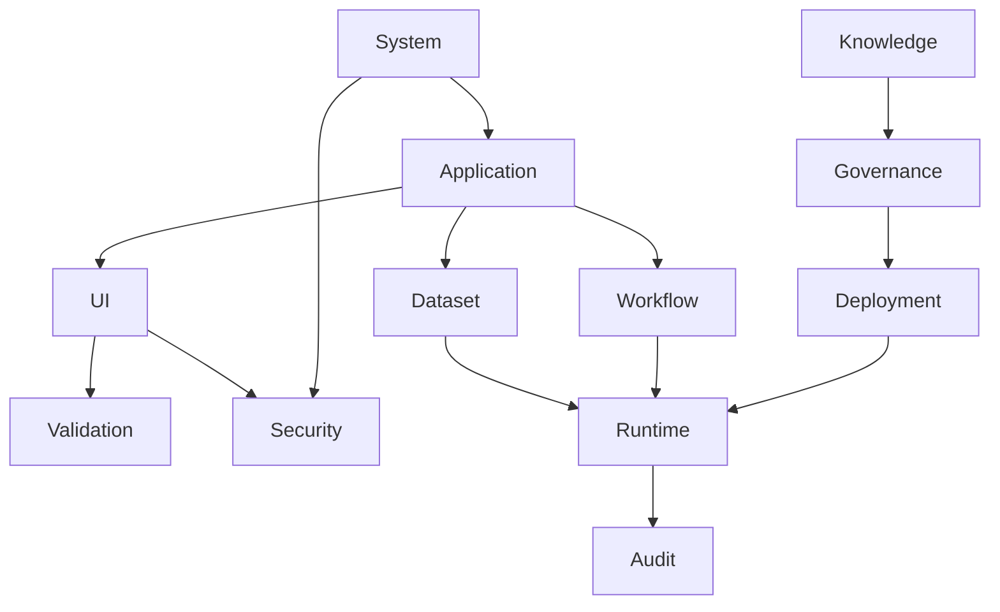

# Chapter 03
# Domain Model

---

# 1. Purpose

This chapter defines the Enterprise Domain Model of the Oracle Metadata Repository.

The Domain Model identifies the major metadata entities, aggregate boundaries, ownership, lifecycle, and relationships that constitute the logical information model of the Oracle Dynamic Application Framework (ODAF).

This model is technology-independent.

Physical Oracle implementation is defined in later chapters.

---

# 2. Objectives

The Domain Model SHALL:

- establish a common business vocabulary;
- define metadata ownership;
- identify aggregate boundaries;
- minimize coupling;
- maximize cohesion;
- support long-term evolution.

---

# 3. Domain Modeling Principles

The Domain Model follows these principles.

- Every entity belongs to one domain.
- Every aggregate has one Aggregate Root.
- Every entity has one owner.
- Cross-domain references SHALL occur only through Aggregate Roots.
- Domain entities SHALL remain technology independent.
- Physical database design SHALL follow the Domain Model.

---

# 4. Enterprise Domain Map

```text
ODAF Platform

├── Application Domain
├── User Interface Domain
├── Dataset Domain
├── Workflow Domain
├── Validation Domain
├── Security Domain
├── Reporting Domain
├── Notification Domain
├── Integration Domain
├── Runtime Domain
├── Deployment Domain
├── Audit Domain
├── Governance Domain
├── Knowledge Domain
└── System Domain
```

Each domain represents a bounded architectural context.

---

# 5. Domain Relationships



Domain dependencies SHALL remain acyclic whenever practical.

---

# 6. Domain Catalog

| Domain | Aggregate Root | Prefix |
|----------|----------------|---------|
| Application | Application | APP_ |
| User Interface | Page | UI_ |
| Dataset | Dataset | DS_ |
| Workflow | Workflow | WF_ |
| Validation | Validation Rule | VAL_ |
| Security | Role | SEC_ |
| Reporting | Report | RPT_ |
| Notification | Notification | NTF_ |
| Integration | Integration | INT_ |
| Runtime | Runtime Model | RT_ |
| Deployment | Deployment Package | DEP_ |
| Audit | Audit Log | AUD_ |
| Governance | Change Request | GOV_ |
| Knowledge | Knowledge Item | KB_ |
| System | System Configuration | SYS_ |

---

# 7. Application Domain

## Purpose

Defines the logical structure of business applications.

### Aggregate Root

Application

### Child Entities

- Module
- Menu
- Page
- Navigation Group

### Responsibilities

- application hierarchy;
- module organization;
- navigation;
- ownership.

---

# 8. User Interface Domain

## Purpose

Defines presentation metadata.

### Aggregate Root

Page

### Child Entities

- Tab
- Panel
- Section
- Group
- Field
- Button
- Toolbar

### Responsibilities

- page layout;
- navigation;
- user interaction.

---

# 9. Dataset Domain

## Purpose

Defines all metadata required for data retrieval and persistence.

### Aggregate Root

Dataset

### Child Entities

- SQL Definition
- Parameter
- Column
- Join
- Filter
- Sort
- LOV
- Cache Policy

### Responsibilities

- query definition;
- data binding;
- paging;
- filtering.

---

# 10. Workflow Domain

## Purpose

Defines executable business processes.

### Aggregate Root

Workflow

### Child Entities

- State
- Transition
- Action
- Approval
- Timer
- Escalation

---

# 11. Validation Domain

## Purpose

Defines metadata-driven validation.

### Aggregate Root

Validation Rule

### Child Entities

- Expression
- Regex
- SQL Validation
- PL/SQL Validation
- Error Message

---

# 12. Security Domain

## Purpose

Defines authorization metadata.

### Aggregate Root

Role

### Child Entities

- User
- Permission
- Object Permission
- Policy
- Session Rule

---

# 13. Reporting Domain

## Purpose

Defines reporting metadata.

### Aggregate Root

Report

### Child Entities

- Template
- Layout
- Parameter
- Export Format
- Schedule

---

# 14. Notification Domain

## Purpose

Defines notification behavior.

### Aggregate Root

Notification

### Child Entities

- Template
- Channel
- Recipient Rule
- Trigger

---

# 15. Integration Domain

## Purpose

Defines integration metadata.

### Aggregate Root

Integration

### Child Entities

- REST Endpoint
- SOAP Service
- Database Link
- API Mapping
- Queue

---

# 16. Runtime Domain

## Purpose

Defines compiled runtime metadata.

### Aggregate Root

Runtime Model

### Child Entities

- Runtime Page
- Runtime Dataset
- Runtime Workflow
- Runtime Object Graph

---

# 17. Deployment Domain

## Purpose

Defines deployment metadata.

### Aggregate Root

Deployment Package

### Child Entities

- Release
- Environment
- Deployment
- Rollback
- Manifest

---

# 18. Audit Domain

## Purpose

Defines immutable historical records.

### Aggregate Root

Audit Log

### Child Entities

- Change Detail
- Login History
- Deployment History
- Workflow History

---

# 19. Governance Domain

## Purpose

Defines architecture governance.

### Aggregate Root

Change Request

### Child Entities

- ADR
- Review
- Approval
- Architecture Principle
- Architecture Constraint

---

# 20. Knowledge Domain

## Purpose

Defines reusable architectural knowledge.

### Aggregate Root

Knowledge Item

### Child Entities

- Reference
- Standard
- Guideline
- Best Practice

---

# 21. System Domain

## Purpose

Defines platform configuration.

### Aggregate Root

System Configuration

### Child Entities

- Environment
- Parameter
- Locale
- Feature Flag
- Scheduler Configuration

---

# 22. Aggregate Rules

Every aggregate SHALL satisfy:

- exactly one Aggregate Root;
- internal consistency;
- transactional integrity;
- ownership;
- lifecycle independence.

Child entities SHALL NOT be referenced directly from other aggregates.

---

# 23. Entity Lifecycle

Every aggregate follows the lifecycle below.

```text
Draft

↓

Approved

↓

Compiled

↓

Deployed

↓

Active

↓

Deprecated

↓

Archived
```

Lifecycle transitions SHALL be controlled by metadata.

---

# 24. Domain Ownership

| Domain | Owner |
|----------|-------|
| Application | Application Architecture |
| UI | UI Architecture |
| Dataset | Data Architecture |
| Workflow | Workflow Architecture |
| Validation | Business Rules Team |
| Security | Security Architecture |
| Reporting | Reporting Team |
| Notification | Integration Team |
| Integration | Integration Architecture |
| Runtime | Runtime Team |
| Deployment | DevOps Team |
| Audit | Platform Team |
| Governance | Architecture Board |
| Knowledge | Architecture Board |
| System | Platform Operations |

---

# 25. Traceability

Every aggregate SHALL participate in the architecture traceability model.

```text
Business Goal

↓

Architecture Driver

↓

Architecture Principle

↓

Aggregate

↓

Oracle Table

↓

PL/SQL Package

↓

Runtime Service
```

---

# 26. Risks

Potential risks include:

- oversized aggregates;
- cyclic dependencies;
- unclear ownership;
- duplicated metadata;
- inconsistent lifecycle.

These risks SHALL be mitigated through governance and metadata validation.

---

# 27. Summary

The Enterprise Domain Model defines the logical information architecture of the Oracle Metadata Repository.

By organizing metadata into bounded domains with clearly defined aggregate roots, ownership, lifecycle, and responsibilities, the platform establishes a stable conceptual model from which the Enterprise ERD, Oracle DDL, PL/SQL packages, and runtime implementation are derived.

---

# Aggregate Catalog

| Aggregate Root | Planned Oracle Tables |
|----------------|----------------------:|
| Application | 15–20 |
| Page | 25–35 |
| Dataset | 20–30 |
| Workflow | 15–25 |
| Validation Rule | 10–15 |
| Role | 20–30 |
| Report | 10–15 |
| Notification | 5–10 |
| Integration | 10–15 |
| Runtime Model | 15–20 |
| Deployment Package | 10–15 |
| Audit Log | 20–30 |
| Change Request | 10–15 |
| Knowledge Item | 5–10 |
| System Configuration | 10–15 |

---

# Next Document

➡ **04-Metadata-Architecture.md**

The next chapter defines the internal architecture of metadata itself, including metadata taxonomy, inheritance model, composition rules, metadata dependencies, compiler boundaries, and the transformation of design metadata into compiled runtime metadata.